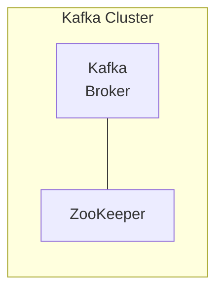
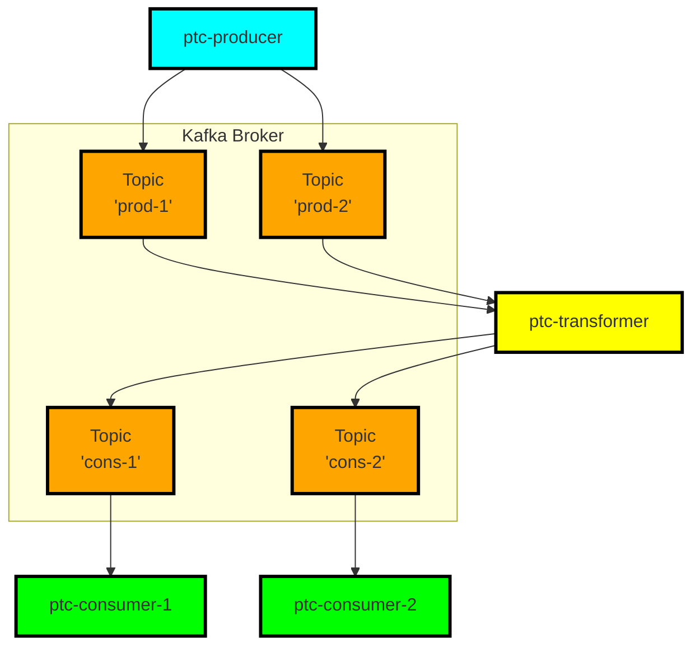
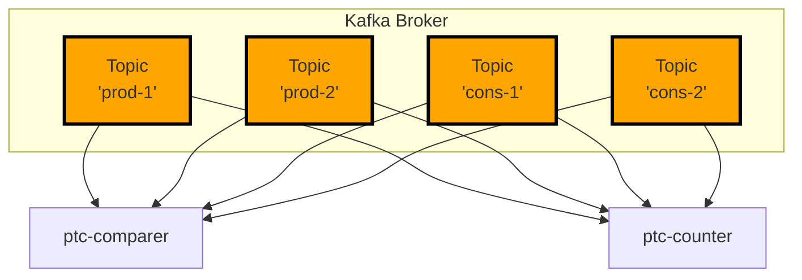

```mermaid
flowchart LR
 subgraph Kafka Cluster
  BRO[Kafka\nBroker]
  ZOO[ZooKeeper]
 end
 
 BRO --- ZOO
```

```mermaid
flowchart TD
 subgraph Kafka Broker
  TP1[Topic\n'prod-1']:::orangeBox
  TP2[Topic\n'prod-2']:::orangeBox
  TC1[Topic\n'cons-1']:::orangeBox
  TC2[Topic\n'cons-2']:::orangeBox
 end
 PRD[ptc-producer]:::cyanBox
 TRA[ptc-transformer]:::yellowBox
 CON1[ptc-consumer-1]:::greenBox
 CON2[ptc-consumer-2]:::greenBox
 
 PRD --> TP1 & TP2 --> TRA --> TC1 & TC2
 TC1 --> CON1
 TC2 --> CON2
 
 classDef cyanBox    fill:#00ffff,stroke:#000,stroke-width:3px
 classDef greenBox   fill:#00ff00,stroke:#000,stroke-width:3px
 classDef orangeBox  fill:#ffa500,stroke:#000,stroke-width:3px
 classDef yellowBox  fill:#ffff00,stroke:#000,stroke-width:3px
```

```mermaid
flowchart TD
 subgraph Kafka Broker
  TP1[Topic\n'prod-1']:::orangeBox
  TP2[Topic\n'prod-2']:::orangeBox
  TC1[Topic\n'cons-1']:::orangeBox
  TC2[Topic\n'cons-2']:::orangeBox
 end
 CMP[ptc-comparer]
 CNT[ptc-counter]

 TP1 & TP2 & TC1 & TC2 --> CMP & CNT
 
 classDef orangeBox  fill:#ffa500,stroke:#000,stroke-width:3px
```